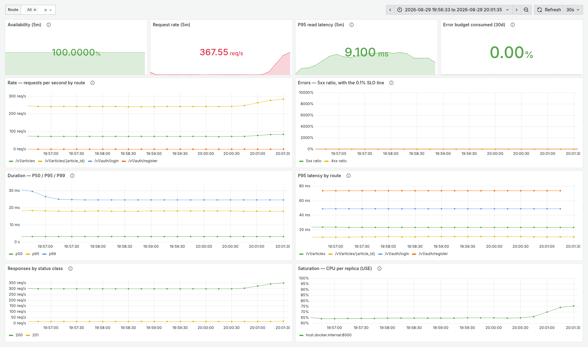
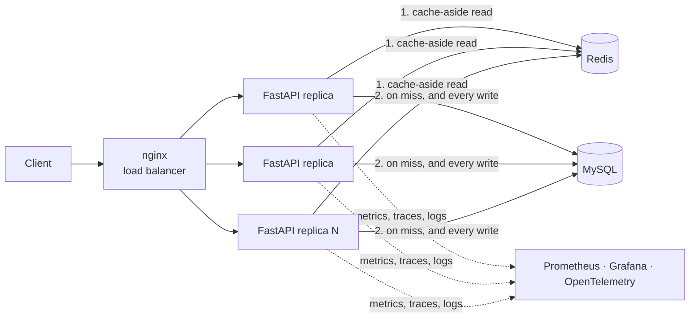

# Scalable Content Platform

[](https://github.com/sibomana-si/scalable-content-platform/actions/workflows/ci.yml)

A read-heavy content API built to be measured. The service is FastAPI on Python with MySQL as
the single source of truth, Redis as a cache-aside layer, and Prometheus, Grafana and
OpenTelemetry for the signals. Docker Compose runs the stack, the load generator and the fault
injector. Three stateless replicas hold 525 req/s at a 10.9 ms read P95 with zero
errors, and every dependency failure becomes a status code instead of a hang.

## Measured, not claimed

Each target was set before the build. Each measured value comes from the
[load-test report](docs/performance/load-test-report.md) and is recorded in the
[non-functional requirements](docs/requirements/non-functional-requirements.md). One host ran
both the service and the load generator, so the absolute rates describe this machine.

| Metric | Target | Measured | Evidence |
|---|---|---|---|
| Read P50 latency | < 50 ms | **5.7 ms** at 525 req/s, 3 replicas | [load-test report](docs/performance/load-test-report.md) |
| Read P95 latency | < 200 ms | **10.9 ms** at 525 req/s, 3 replicas | [load-test report](docs/performance/load-test-report.md) |
| Read P99 latency | < 450 ms | **22.3 ms** at 525 req/s, 3 replicas | [load-test report](docs/performance/load-test-report.md) |
| Write P95 latency | < 500 ms | **26.2 ms** at 525 req/s, 3 replicas | [load-test report](docs/performance/load-test-report.md) |
| Throughput (sustained) | ≥ 500 req/s | **525 req/s** for 5 min, 0 errors | [load-test report](docs/performance/load-test-report.md) |

Under fault, from the [chaos test report](docs/resilience/chaos-test-report.md):

- **A dead Redis is invisible to clients.** Zero failures and 0.7 ms of extra read P95, with
  MySQL absorbing the whole read load.
- **A dead MySQL costs the uncached reads and nothing else.** Half the reads still answer 200
  from cache. The rest answer 503 with a `Retry-After` in under 5 ms, and the service recovers on
  its own within 65 s of the fault clearing.



The API Overview dashboard during the steady run of 2026-08-29, one replica at 367.6 req/s. The
[dashboards catalog](docs/observability/dashboards.md) shows all four dashboards, with what to
read on each.

## Architecture at a glance



A read is served in this order:

1. The load-shed middleware admits the request if fewer than 90 are in flight. Otherwise it
   answers 503 at once.
2. The service asks Redis for the article, or for the list page under its generation counter.
3. On a miss, the repository reads MySQL through a guard that composes circuit breaker, timeout
   and one jittered retry.
4. The result is written back to Redis with a jittered TTL, and single-flight stops a stampede
   on the same key.

Writes commit to MySQL first. The cache invalidation runs after the commit, so a reader can never
cache a row that the transaction later rolls back.

Read the structure in the [architecture overview](docs/architecture/overview.md) and the five
required diagrams in the [diagram inventory](docs/architecture/diagrams/README.md).

## Run it

```bash
python3.14 -m venv .venv && source .venv/bin/activate
pip install -r requirements-dev.txt
cp .env.example .env
docker compose up -d                 # MySQL 8 and Redis 7
alembic upgrade head
uvicorn app.main:app --reload        # http://127.0.0.1:8000/v1/articles
pytest -q
```

The [contributing guide](CONTRIBUTING.md) covers the compose profiles, the load and chaos
harness, and the rule to stop services by name and never run `docker compose down`.

## Repository layout

- `app/` — the service, layered as `api` → `services` → `repositories`, with `cache`,
  `resilience`, `observability` and `security` alongside.
- `tests/` — `unit` and `smoke` need no containers. `integration` and `acceptance` run against
  real MySQL and Redis. `load` holds the k6 scripts.
- `migrations/` — Alembic revisions. The schema changes only through a revision.
- `scripts/` — the load-test matrix, the dataset seeder, the result plotter and the fault
  injector.
- `docs/` — the mkdocs site: requirements, architecture and ADRs, runbooks and reports.
- `grafana/` and `prometheus/` — provisioned dashboards, scrape config and alert rules.

## Quality gates

- **Test-first.** Every behavior starts as a failing test, per
  [ADR-0006](docs/architecture/adr/0006-test-driven-development.md). The suite holds more than
  1,000 tests at 98% line coverage, with an 80% floor that fails the build.
- **Documents that execute.** The load-test report, the chaos report, the dashboards catalog and
  this README each have a unit test that fails when a figure drifts from its source or a
  placeholder survives.
- **Lint and docs.** `ruff check`, `ruff format --check` and `mkdocs build --strict` gate every
  commit, locally and in CI.

## Documentation map

Open these three first:

1. [Architecture overview](docs/architecture/overview.md) — the C4 views and the component table.
2. [Load-test report](docs/performance/load-test-report.md) — the method, the numbers and the
   noise floor.
3. [Chaos test report](docs/resilience/chaos-test-report.md) — five faults, what each cost, and
   the defect they found.

The full site index is [docs/README.md](docs/README.md). The
[trade-off analysis](docs/architecture/trade-off-analysis.md) and the
[capacity model](docs/architecture/capacity-scaling-model.md) explain the decisions.

## License

[MIT](LICENSE).
