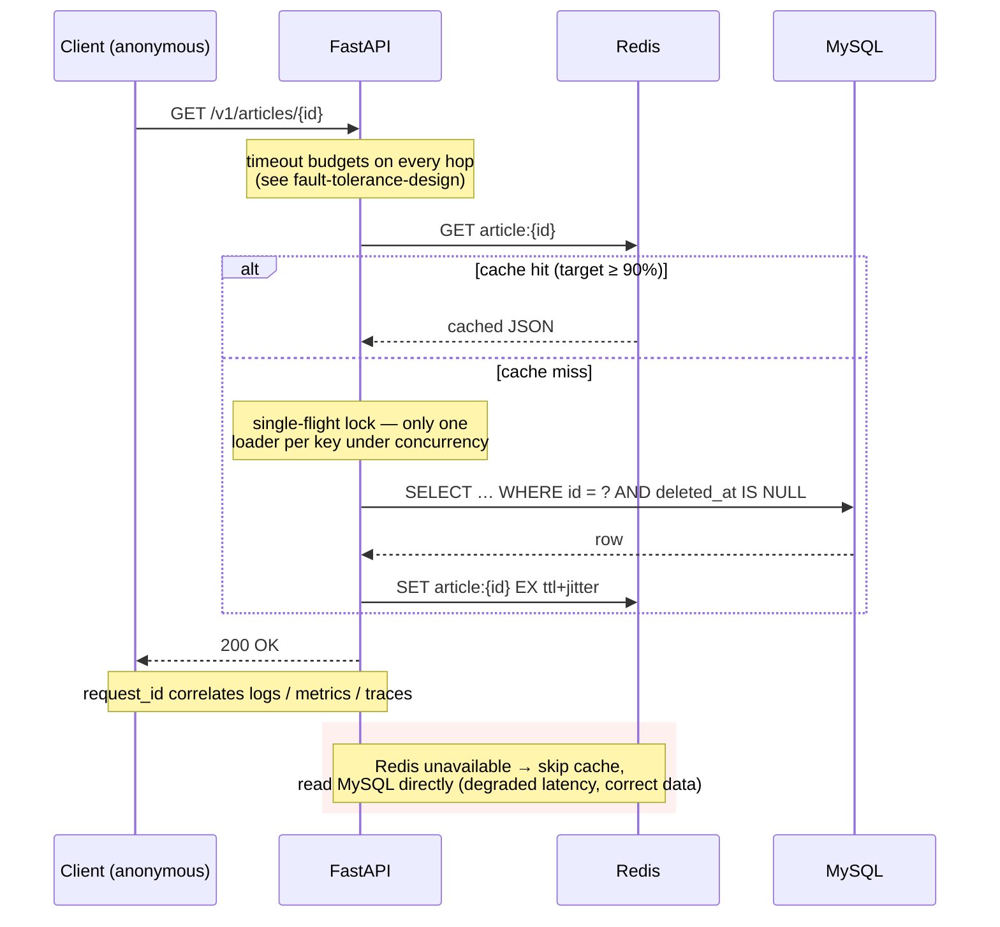
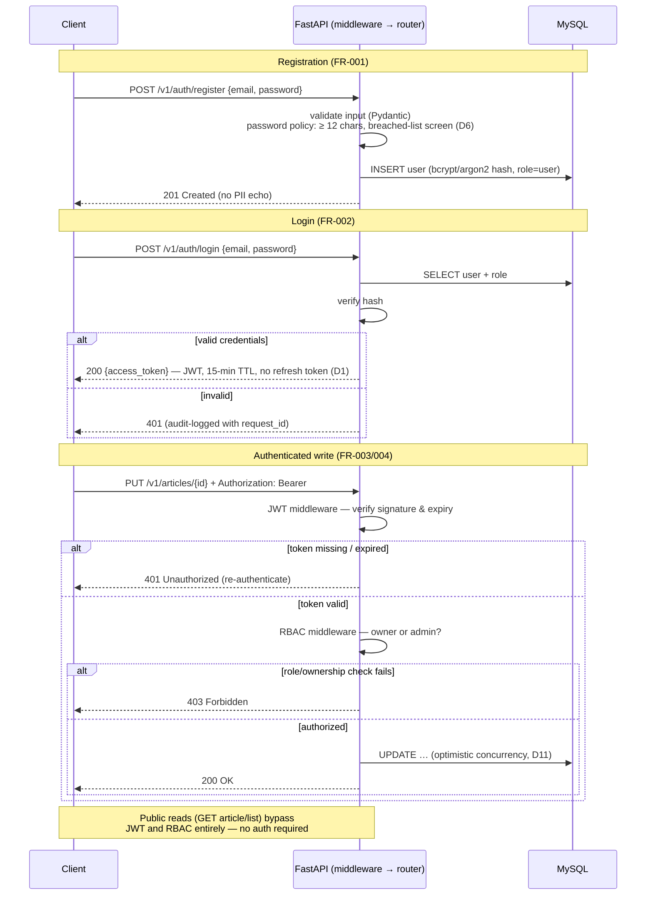
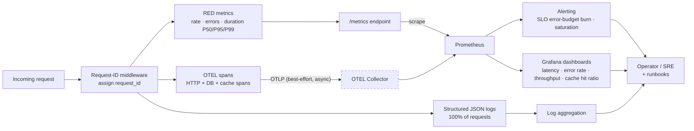
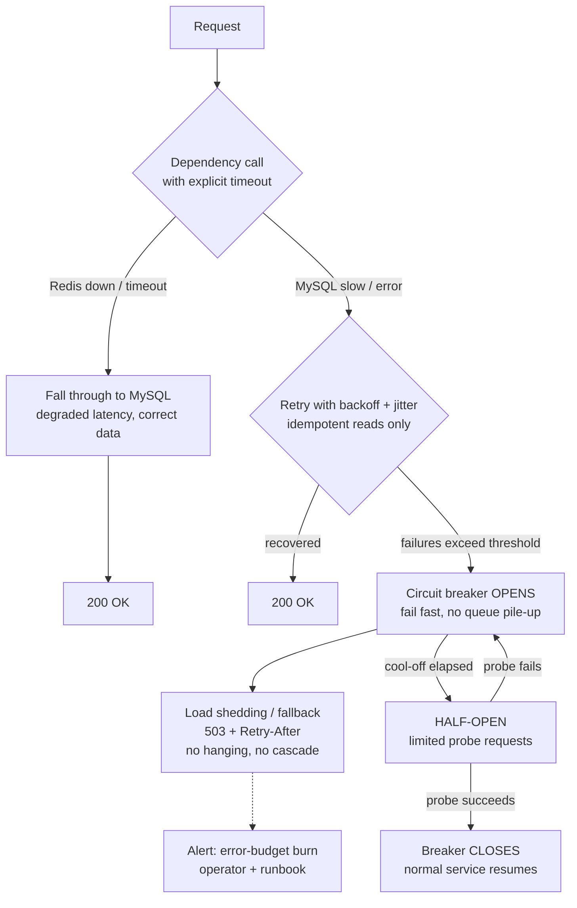

# Diagrams (source-controlled)

> **Status:** 🟧 In progress · **Owner:** Simon Sibomana · **Last updated:** 2026-06-10

Diagrams are kept as **code** (Mermaid) so they are diffable and reviewed in PRs. The `.mmd` files in
this directory are the canonical sources; this page embeds the same Mermaid for rendering in the docs
site. When a diagram changes, update the `.mmd` source and the embedded copy together. Export rendered
images only when needed for reports.

## Diagram inventory

| # | Diagram (required by the project brief) | Source | Rendered |
|---|---|---|---|
| 1 | High-level system architecture (C4 L1/L2) | — (maintained inline) | [overview.md](../overview.md) |
| 2 | Request flow — read path (cache-aside) | [`read-path.mmd`](read-path.mmd) | below |
| 3 | Authentication & authorization flow | [`auth-flow.mmd`](auth-flow.mmd) | below |
| 4 | Observability signal flow | [`observability-flow.mmd`](observability-flow.mmd) | below |
| 5 | Failure handling (resilience) | [`failure-handling.mmd`](failure-handling.mmd) | below |

## 2. Read path (cache-aside)

The performance-critical journey ([PRD G1](../../requirements/product-requirements.md): read P95 < 200 ms).
Cache-aside with TTL + jitter and single-flight loading guards against stampedes
([caching-strategy](../../data/caching-strategy.md)); a cold or unavailable Redis degrades latency,
never correctness.

## 3. Authentication & authorization flow

Registration ([D6 password policy](../../requirements/product-requirements.md)), login issuing a
15-minute JWT with no refresh token ([D1](../../requirements/product-requirements.md)), and the
middleware order on authenticated writes: JWT validation (`401`) before RBAC (`403`). Public reads
bypass both — see [authn-authz](../../security/authn-authz.md).

## 4. Observability signal flow

Every request emits the three signals — JSON logs, RED metrics, OTEL traces — correlated by
`request_id`. Telemetry export is **best-effort**: collector loss must never fail or slow request
handling ([PRD §10](../../requirements/product-requirements.md)). Details in the
[observability guide](../../observability/observability-guide.md).

## 5. Failure handling (resilience)

The degradation ladder when dependencies misbehave: Redis loss falls through to MySQL; MySQL
impairment is bounded by timeouts → bounded retries with backoff → circuit breaker → load shedding
with an explicit `503 + Retry-After`, never a hang or cascade. Policies and budgets in
[fault-tolerance-design](../../resilience/fault-tolerance-design.md).

**Invariants encoded above:** every external call has a timeout (nothing waits forever); retries are
bounded and backed off (no retry storms); Redis loss is a latency event, never a correctness event;
MySQL impairment produces fast, explicit errors — not cascading hangs.
