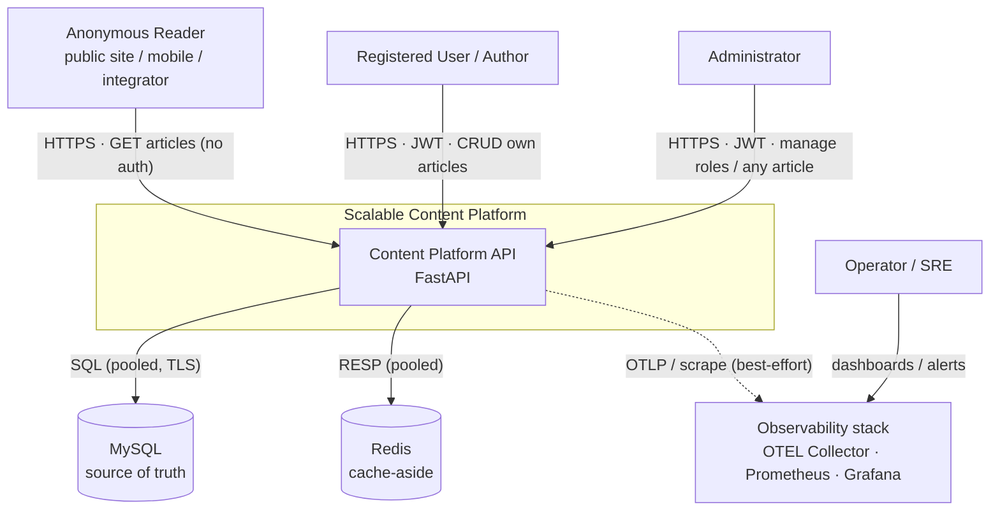
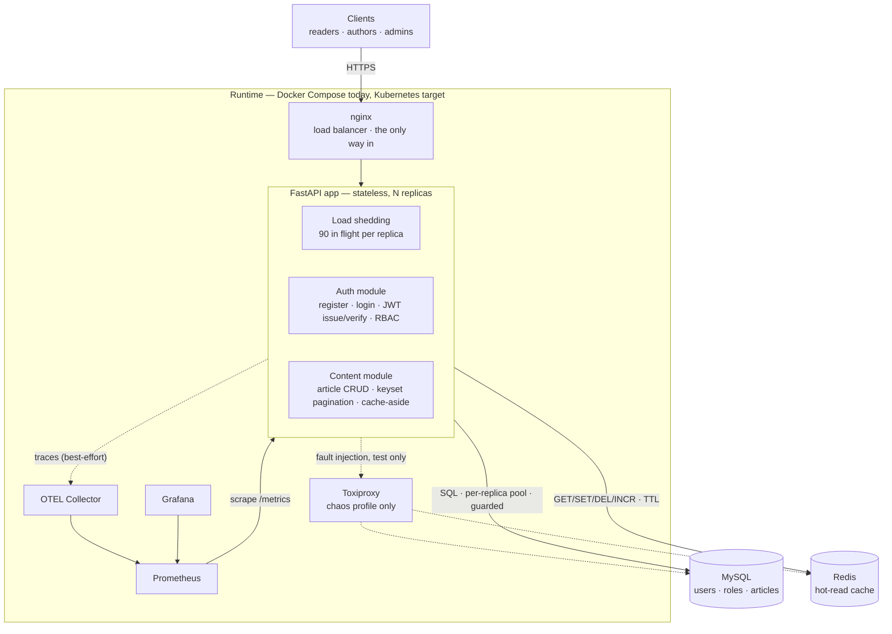
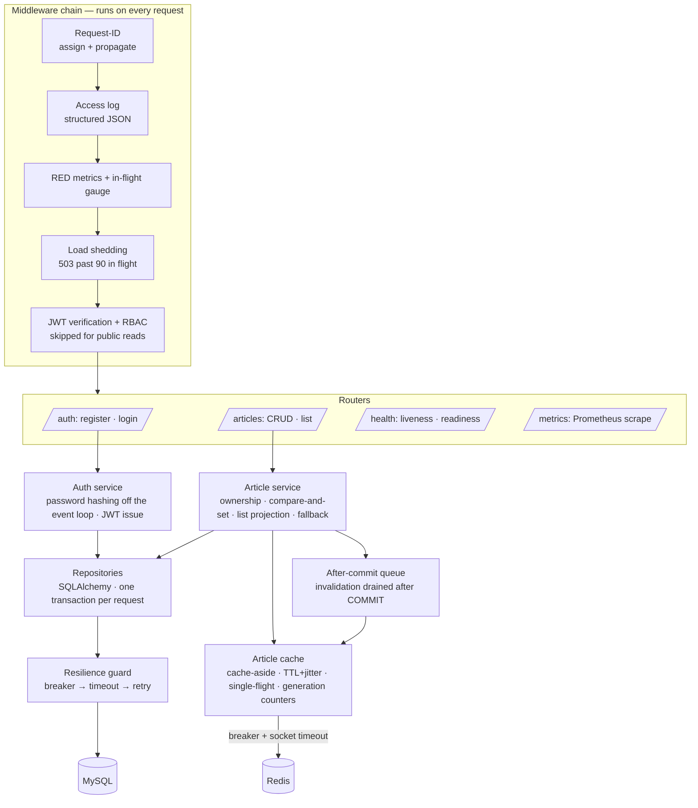
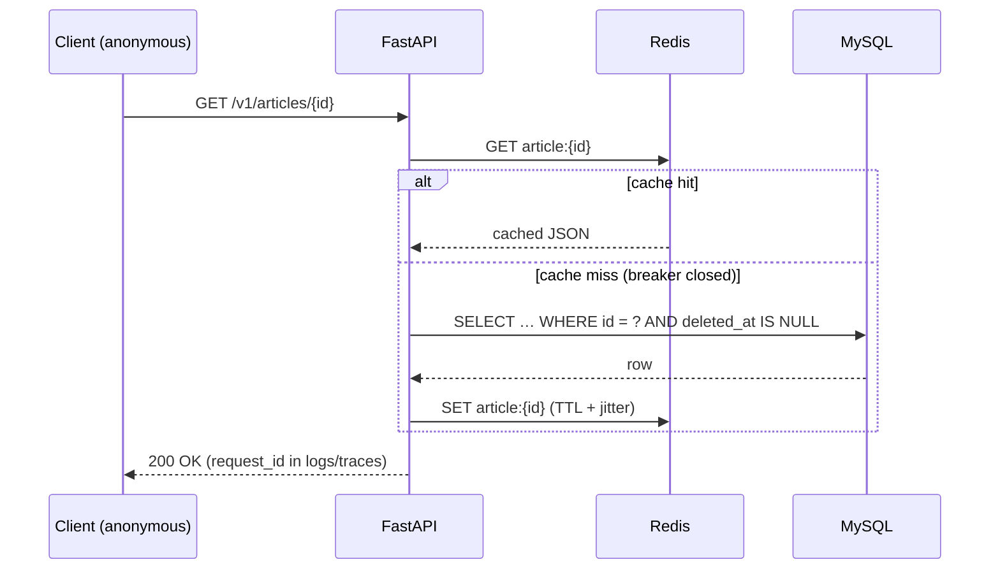

# System Architecture Overview (C4)

> **Status:** ✅ Approved · **Owner:** Simon Sibomana · **Last updated:** 2026-09-08

Documented using the [C4 model](https://c4model.com/): Context → Container → Component. This is the
architectural companion to the approved [product requirements](../requirements/product-requirements.md);
every structural choice here traces to a charter decision ([PRD §13 D1–D12](../requirements/product-requirements.md))
or a measurable target in the [NFR](../requirements/non-functional-requirements.md). Diagram sources live in
[diagrams/](diagrams/README.md).

## 1. System Context (C4 L1)

Who and what interacts with the system, and its external dependencies. The personas come from
[PRD §5](../requirements/product-requirements.md): the **Anonymous Reader** is the highest-volume actor
and drives the read-optimized design; the **Operator/SRE** consumes telemetry, not the API.

**Trust boundary:** everything inside the platform runs in the cluster's private network. Only the API
is exposed (HTTPS, TLS 1.2+, via the ingress/gateway); MySQL, Redis, and the observability stack are
never internet-reachable. Reads are public by design; writes and admin actions cross an authentication
boundary (JWT) and an authorization boundary (RBAC) — see [security/authn-authz.md](../security/authn-authz.md).

## 2. Container View (C4 L2)

Deployable and runtime units, and how they communicate. The brief's "Auth Service / Content Service"
are **modules of one stateless FastAPI deployable**, not separate services (§4,
[ADR-0002](adr/0002-modular-monolith.md)). Docker Compose runs the units today; the `scale`
profile adds nginx and N replicas, the `chaos` profile adds Toxiproxy. Kubernetes is the target
described in [operations/deployment.md](../operations/deployment.md) and is not yet proven.

| Container | Responsibility | State | Scaling |
|---|---|---|---|
| nginx (gateway) | Round-robin over the replicas; TLS termination and security headers at the production gateway | None | Managed / horizontal |
| **FastAPI app** | All API behavior: auth, RBAC, article CRUD, public reads, cache-aside, load shedding, timeouts and breakers | **None** (stateless; no sticky sessions) | Horizontal — the M6 matrix measured the knee at about 450 req/s per replica and 525 req/s held on three ([load-test report](../performance/load-test-report.md)) |
| MySQL | **Single source of truth** — `users`, `roles`, `articles` | Durable | Vertical first; read replicas are the documented next move ([capacity model](capacity-scaling-model.md)) |
| Redis | Cache-aside for hot reads and the generation counters for list pages; may be cold or empty at any time | Disposable | Single node; loss costs 0.7 ms of read P95 and no correctness ([chaos report](../resilience/chaos-test-report.md)) |
| OTEL Collector / Prometheus / Grafana | Telemetry pipeline, metrics storage, dashboards | Operator-facing | Off the request path; a failure here never fails a request ([PRD §10](../requirements/product-requirements.md)) |
| Toxiproxy | Fault injection between the app and its dependencies, `chaos` profile only | None | Test harness, never deployed ([chaos runbook](../resilience/chaos-test-runbook.md)) |
| Retention purge worker | Hard-purges articles soft-deleted past retention ([PRD §13 D3](../requirements/product-requirements.md), FR-006) | None (idempotent jobs) | **Planned, not built.** A single scheduled instance off the request path |

**Statefulness rule:** only MySQL holds durable state and only Redis holds transient state. App
replicas keep nothing between requests, which is what makes horizontal scaling and zero-downtime
rollouts safe.

## 3. Component View (C4 L3)

Internal structure of the FastAPI container: a conventional layered design,
**middleware → routers → services → repositories/cache**, so request-path concerns apply once,
uniformly, and each layer is testable on its own.

| Component | Responsibility | Driven by |
|---|---|---|
| Request-ID middleware | Assign `request_id`, propagate to logs, metrics and traces | [NFR observability](../requirements/non-functional-requirements.md) |
| Access log and metrics middleware | JSON logs for 100% of requests; RED metrics; the `inflight_requests` gauge; OTEL spans | [observability-guide](../observability/observability-guide.md) |
| Load-shed middleware | Refuse the request past `MAX_INFLIGHT_REQUESTS` (90) with 503 and `Retry-After`, before any router; probes and the scrape are exempt | [ADR-0012](adr/0012-timeout-retry-and-circuit-breaker-policy.md) |
| JWT and RBAC middleware | Validate 15-min access tokens, `401` on missing or expired; enforce `user`/`admin` on every write route, `403` on role mismatch; public reads bypass | [PRD §13 D1](../requirements/product-requirements.md), FR-002, FR-003, [authn-authz](../security/authn-authz.md) |
| Article service | Ownership checks, `PUT` full-replace (D10), compare-and-set `409` (D11), cache invalidation on write; a DB outage with a cache hit still serves the cached body | [PRD §13 D5/D10/D11](../requirements/product-requirements.md), FR-004 |
| List projection | `ArticleSummaryOut` drops the body from list pages: 101,367 bytes became 2,935 per page of 20 | [bottleneck-analysis F2](../performance/bottleneck-analysis.md) |
| List and pagination logic | Keyset cursor on `(created_at, id)`, bounded page size, `author` filter only | [PRD §13 D7/D9](../requirements/product-requirements.md), FR-005 |
| Article cache | Cache-aside with TTL + jitter and single-flight; list pages keyed under a global and a per-author generation counter, so one `INCR` invalidates every page | [ADR-0010](adr/0010-generation-counter-list-invalidation.md), [caching-strategy](../data/caching-strategy.md) |
| After-commit queue | `app/db/after_commit.py` holds the invalidation per session and `get_session` drains it after `COMMIT`, so a reader never caches a row that later rolls back | [ADR-0010](adr/0010-generation-counter-list-invalidation.md) |
| Repositories | All SQL behind one layer; pooled connections; soft-delete filtering (`deleted_at IS NULL`); one transaction per request | [indexing-strategy](../data/indexing-strategy.md), D3 |
| Resilience guard | `app/resilience/guard.py` composes breaker → timeout → retry around every repository call; reads retry once with full jitter, writes never retry; a MySQL query is capped server-side at 2 s | [ADR-0012](adr/0012-timeout-retry-and-circuit-breaker-policy.md), [fault-tolerance-design](../resilience/fault-tolerance-design.md) |
| Health endpoints | Distinct liveness and readiness probes; only MySQL decides readiness, so a cache outage never removes every replica at once | [NFR operability](../requirements/non-functional-requirements.md) |

## 4. Key Architectural Choices

> **Note on terminology:** the project brief describes Auth/Content as "services," but the
> deployable unit is a single stateless FastAPI app. The honest name is a **modular monolith with
> clear service boundaries**: the module seams (auth vs. content) are the future split lines if
> scale ever demands it. Rationale in [ADR-0002](adr/0002-modular-monolith.md).

| Choice | Serves | Decision record |
|---|---|---|
| Stateless FastAPI services (no sticky sessions) | Horizontal scaling (G4); zero-downtime rollouts | [ADR-0002](adr/0002-modular-monolith.md) |
| MySQL as the single source of truth | Correctness under cache loss; transactional writes | [ADR-0003](adr/0003-mysql-source-of-truth.md) |
| Redis cache-aside on hot reads | Read P95 < 200 ms (G1); the DB shielded on the hot set | [ADR-0004](adr/0004-redis-cache-aside.md) |
| Generation counters for list invalidation | One `INCR` per write instead of a key scan; a write by one author leaves every other author's pages cached | [ADR-0010](adr/0010-generation-counter-list-invalidation.md) |
| Stateless JWT (15-min TTL) + RBAC middleware | Secure boundaries (G2) without a session store | [ADR-0005](adr/0005-stateless-jwt-auth.md) |
| Prometheus/Grafana + OpenTelemetry, correlated by `request_id` | Production debuggability (G5) | [ADR-0009](adr/0009-observability-stack.md) |
| Timeouts, one retry, circuit breakers, load shedding, graceful fallback | Availability under partial failure (G3); every failure becomes a status code in bounded time | [ADR-0012](adr/0012-timeout-retry-and-circuit-breaker-policy.md), [fault-tolerance-design](../resilience/fault-tolerance-design.md) |
| k6 in the open model, one pinned generator, a stated noise floor | Numbers a reader can trust and repeat | [ADR-0011](adr/0011-k6-for-load-testing.md) |

The cross-cutting trade-offs behind these choices, what each one costs and what was rejected, are
analyzed in [trade-off-analysis.md](trade-off-analysis.md).

## 5. Runtime Views

The five runtime diagrams the brief requires are maintained as code in
[diagrams/](diagrams/README.md). Each one proves a different claim:

1. **System architecture (C4 L1/L2)** — §1 and §2 of this page: what runs where, and that no
   replica holds state.
2. **Read path** ([`read-path.mmd`](diagrams/read-path.mmd)) — cache-aside with single-flight, so
   a miss reaches MySQL once, however many readers ask at the same moment.
3. **Auth flow** ([`auth-flow.mmd`](diagrams/auth-flow.mmd)) — 401 is decided before 403, and no
   request touches a session store.
4. **Observability signal flow** ([`observability-flow.mmd`](diagrams/observability-flow.mmd)) —
   one `request_id` joins the log line, the metric label and the trace.
5. **Failure handling** ([`failure-handling.mmd`](diagrams/failure-handling.mmd)) — the order
   breaker → timeout → retry, and which status code each exit returns.

The **hot read path** is the performance-critical journey (PRD G1 — read P95 < 200 ms) and is
worth showing inline:

Every hop carries an explicit timeout, so the path degrades in bounded time instead of hanging.
The budgets are in [fault-tolerance-design.md](../resilience/fault-tolerance-design.md), and the
[chaos report](../resilience/chaos-test-report.md) records what each budget cost under a real fault.

## 6. What the measurements changed

The boxes above are the shape they are because the load tests and the fault injection said so.
Five changes came from measurement, not from design:

- **The list projection.** One default list page carried 101,367 bytes, 96.7% of it article
  bodies nobody asked for. `ArticleSummaryOut` cut the page to 2,935 bytes, a 97.1% reduction, and
  it is the largest single latency win in the project
  ([bottleneck-analysis F2](../performance/bottleneck-analysis.md)).
- **The shed limit.** One replica's knee measured at about 450 req/s. Little's law with the 0.2 s
  read SLO gives 90 requests in flight, and that is the `MAX_INFLIGHT_REQUESTS` default. Past it the
  replica refuses instead of queueing
  ([ADR-0012](adr/0012-timeout-retry-and-circuit-breaker-policy.md)).
- **The list cache stays, on evidence.** Under the specified workload the list cache serves
  under 10% of list reads, and the ≥ 90% hit-ratio target cannot hold for lists. The `entity`
  label on `cache_hits_total` exists so that decision can be revisited with numbers
  ([bottleneck-analysis F3 and F4](../performance/bottleneck-analysis.md),
  [ADR-0010](adr/0010-generation-counter-list-invalidation.md)).
- **Invalidation after the commit.** The first cut invalidated inside the transaction, which left a
  window where a concurrent reader cached the pre-commit row. The after-commit queue closed it
  ([caching-strategy](../data/caching-strategy.md), [ADR-0010](adr/0010-generation-counter-list-invalidation.md)).
- **A refused connection answered 500.** Fault injection found that a blackholed MySQL answered
  503 through the breaker while a reset connection answered 500 and never opened it. The fix maps
  both to the same 503, and the re-test is experiment 4c
  ([chaos report, finding F1](../resilience/chaos-test-report.md)).

## 7. Cross-cutting Concerns

- **Config and secrets** — 12-factor, environment-driven; never baked into images or committed →
  [operations/configuration-reference.md](../operations/configuration-reference.md),
  [security/secrets-management.md](../security/secrets-management.md)
- **Observability** — JSON logs, RED metrics (P50/P95/P99), OTEL traces with DB and cache spans, all
  correlated by `request_id` → [ADR-0009](adr/0009-observability-stack.md),
  [observability/observability-guide.md](../observability/observability-guide.md)
- **Resilience** — timeout, retry, circuit-breaker and load-shedding policy, and the fallback per
  dependency → [ADR-0012](adr/0012-timeout-retry-and-circuit-breaker-policy.md),
  [resilience/fault-tolerance-design.md](../resilience/fault-tolerance-design.md)
- **Security** — JWT + RBAC, input validation, OWASP API Top 10 coverage →
  [security/authn-authz.md](../security/authn-authz.md), [security/threat-model.md](../security/threat-model.md)
- **Testability** — the layering in §3 exists so each layer is testable on its own (services
  without I/O, repositories and cache against real containers); all application behavior is built
  test-first per [ADR-0006](adr/0006-test-driven-development.md) →
  [development/testing-strategy.md](../development/testing-strategy.md)

## 8. Related Documents

- [Trade-off Analysis](trade-off-analysis.md) — what each choice costs and what was rejected
- [Capacity & Scaling Model](capacity-scaling-model.md) — the numbers behind the scaling claims
- [Diagrams](diagrams/README.md) — source-controlled runtime diagrams
- ADRs: [0001](adr/0001-record-architecture-decisions.md) · [0002](adr/0002-modular-monolith.md) ·
  [0003](adr/0003-mysql-source-of-truth.md) · [0004](adr/0004-redis-cache-aside.md) ·
  [0005](adr/0005-stateless-jwt-auth.md) · [0006](adr/0006-test-driven-development.md) ·
  [0007](adr/0007-single-role-fk.md) · [0008](adr/0008-alembic-migrations.md) ·
  [0009](adr/0009-observability-stack.md) · [0010](adr/0010-generation-counter-list-invalidation.md) ·
  [0011](adr/0011-k6-for-load-testing.md) · [0012](adr/0012-timeout-retry-and-circuit-breaker-policy.md)
