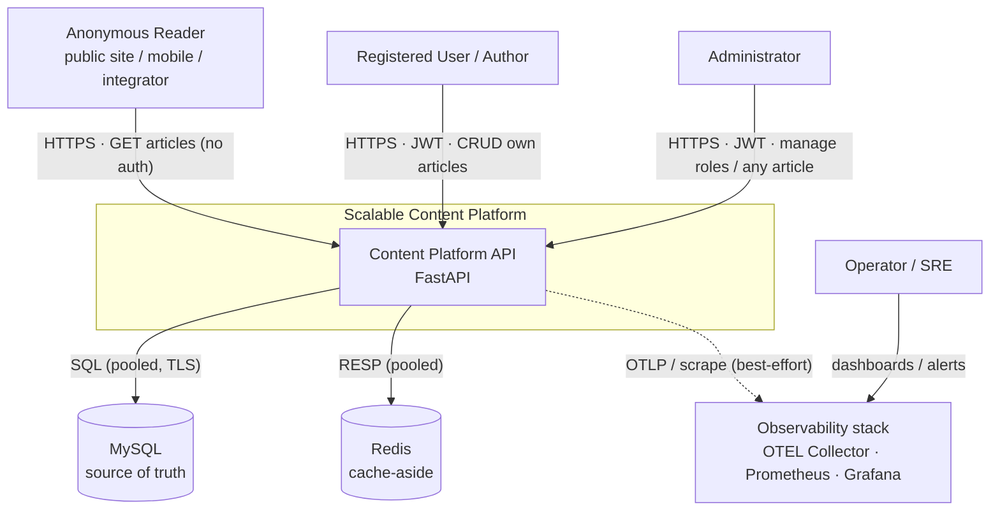
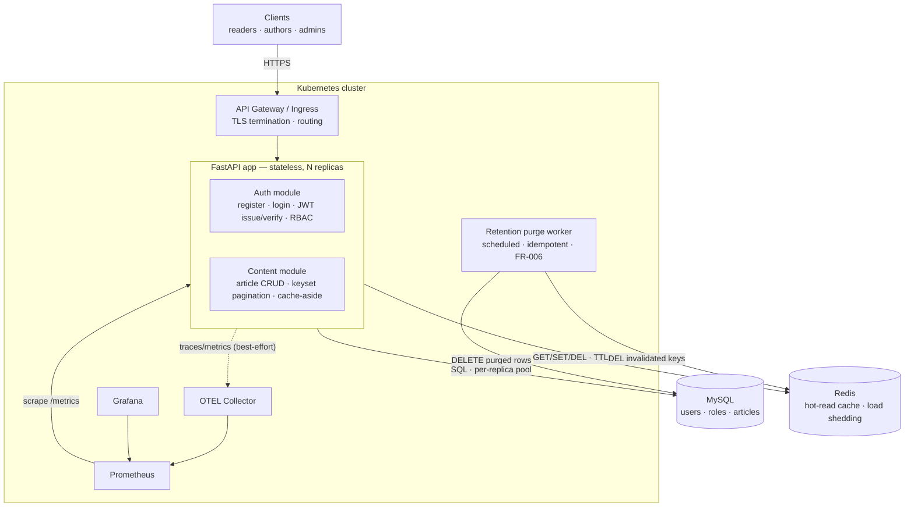
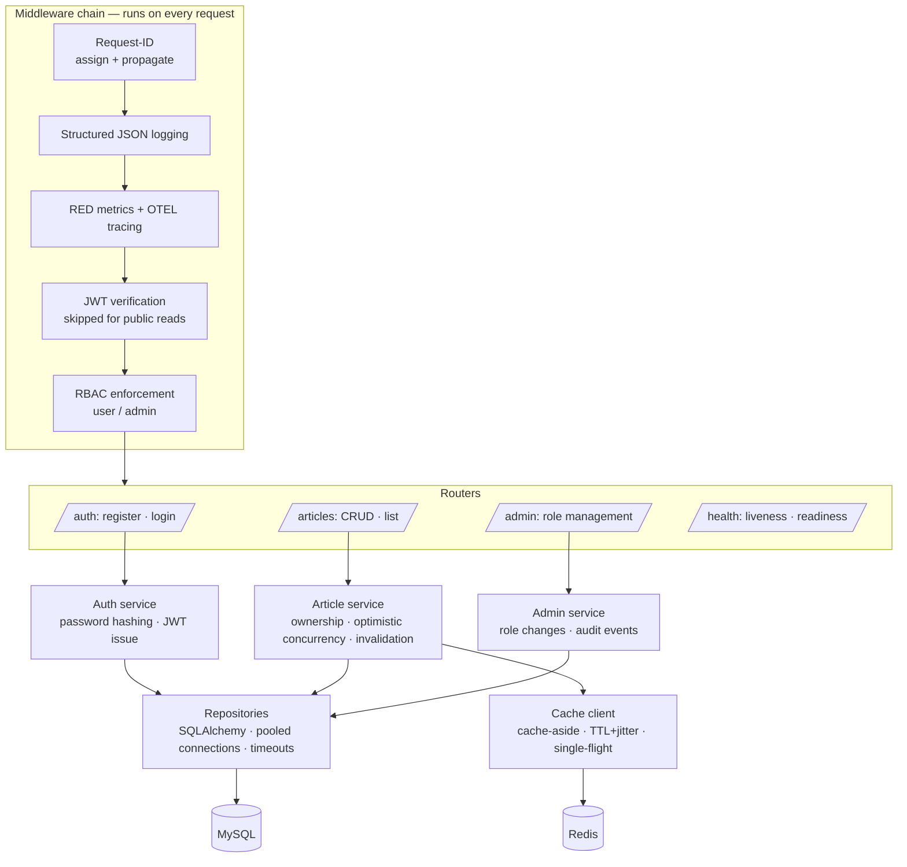
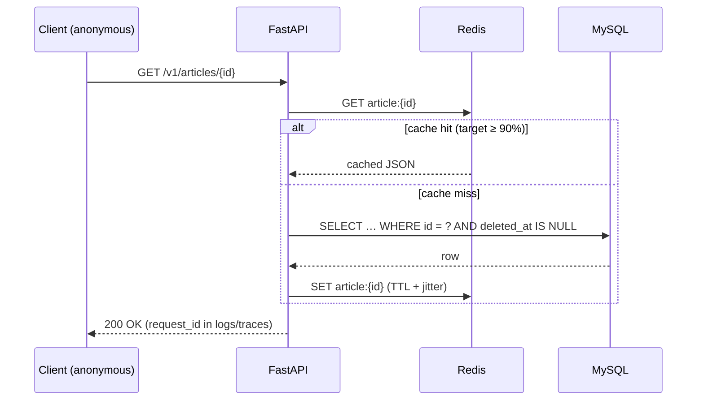

# System Architecture Overview (C4)

> **Status:** ✅ Approved · **Owner:** Simon Sibomana · **Last updated:** 2026-07-10

Documented using the [C4 model](https://c4model.com/): Context → Container → Component. This is the
architectural companion to the approved [product requirements](../requirements/product-requirements.md);
every structural choice here traces to a charter decision ([PRD §13 D1–D12](../requirements/product-requirements.md))
or a measurable target in the [NFR](../requirements/non-functional-requirements.md). Diagram sources live in
[diagrams/](diagrams/README.md).

## 1. System Context (C4 L1)

Who and what interacts with the system, and its external dependencies. The personas come from
[PRD §5](../requirements/product-requirements.md): the **Anonymous Reader** is the highest-volume actor
and drives the read-optimized design; the **Operator/SRE** consumes telemetry, not the API.

**Trust boundary:** everything inside the platform runs in the cluster's private network. Only the API
is exposed (HTTPS, TLS 1.2+, via the ingress/gateway); MySQL, Redis, and the observability stack are
never internet-reachable. Reads are public by design; writes and admin actions cross an authentication
boundary (JWT) and an authorization boundary (RBAC) — see [security/authn-authz.md](../security/authn-authz.md).

## 2. Container View (C4 L2)

Deployable/runtime units and how they communicate. The brief's "Auth Service / Content Service" are
**modules of one stateless FastAPI deployable**, not separate services — see §4 and
[ADR-0002](adr/0002-modular-monolith.md).

| Container | Responsibility | State | Scaling |
|---|---|---|---|
| API Gateway / Ingress | TLS termination, routing, security headers | None | Managed / horizontal |
| **FastAPI app** | All API behavior: auth, RBAC, article CRUD, public reads, cache-aside, load shedding | **None** (stateless; no sticky sessions) | Horizontal — replicas added/removed freely ([NFR scalability](../requirements/non-functional-requirements.md)) |
| Retention purge worker | Hard-purges articles soft-deleted past retention ([PRD §13 D3](../requirements/product-requirements.md), FR-006) | None (idempotent jobs) | Single scheduled instance; off the request path |
| MySQL | **Single source of truth** — `users`, `roles`, `articles` | Durable | Vertical first; read replicas are the documented next move ([capacity model](capacity-scaling-model.md)) |
| Redis | Cache-aside for hot reads; may be cold/empty at any time | Disposable | Single node MVP; loss degrades latency, never correctness |
| OTEL Collector / Prometheus / Grafana | Telemetry pipeline, metrics storage, dashboards | Operator-facing | Off the request path; failure must not break requests ([PRD §10](../requirements/product-requirements.md)) |

**Statefulness rule:** only MySQL holds durable state and only Redis holds transient state. App replicas
keep nothing between requests — this is what makes horizontal scaling and zero-downtime rollouts safe.

## 3. Component View (C4 L3)

Internal structure of the FastAPI container: a conventional layered design —
**middleware → routers → services → repositories/cache** — so request-path concerns are applied once,
uniformly, and each layer is independently testable.

| Component | Responsibility | Driven by |
|---|---|---|
| Request-ID middleware | Assign `request_id`, propagate to logs/metrics/traces | [NFR observability](../requirements/non-functional-requirements.md) |
| Logging / metrics middleware | JSON logs for 100% of requests; RED metrics; OTEL spans | [observability-guide](../observability/observability-guide.md) |
| JWT middleware | Validate 15-min access tokens; `401` on missing/expired; public reads bypass | [PRD §13 D1](../requirements/product-requirements.md), FR-002 |
| RBAC middleware | Enforce `user`/`admin` on 100% of write/admin routes; `403` on role mismatch | FR-003, [authn-authz](../security/authn-authz.md) |
| Article service | Ownership checks, `PUT` full-replace (D10), optimistic concurrency `409` (D11), cache invalidation on write | [PRD §13 D5/D10/D11](../requirements/product-requirements.md), FR-004 |
| List/pagination logic | Keyset cursor on `(created_at, id)`, bounded page size, `author` filter only | [PRD §13 D7/D9](../requirements/product-requirements.md), FR-005 |
| Cache client | Cache-aside with TTL + jitter and single-flight (stampede control) | [caching-strategy](../data/caching-strategy.md) |
| Repositories | All SQL behind one layer; pooled connections; explicit timeouts; soft-delete filtering (`deleted_at IS NULL`) | [indexing-strategy](../data/indexing-strategy.md), D3 |
| Resilience wrappers | Timeouts, retries with backoff, circuit breakers around MySQL/Redis calls | [fault-tolerance-design](../resilience/fault-tolerance-design.md) |
| Health endpoints | Distinct liveness/readiness for Kubernetes probes; readiness reflects dependency health | [NFR operability](../requirements/non-functional-requirements.md) |

## 4. Key Architectural Choices

> **Note on terminology:** the project brief describes Auth/Content as "services," but the deployable
> unit is a single stateless FastAPI app. We document this honestly as a **modular monolith with clear
> service boundaries** — the module seams (auth vs. content) are the future split lines if scale ever
> demands it. Rationale in [ADR-0002](adr/0002-modular-monolith.md).

| Choice | Serves | Decision record |
|---|---|---|
| Stateless FastAPI services (no sticky sessions) | Horizontal scaling (G4); zero-downtime rollouts | [ADR-0002](adr/0002-modular-monolith.md) |
| MySQL as the single source of truth | Correctness under cache loss; transactional writes | [ADR-0003](adr/0003-mysql-source-of-truth.md) |
| Redis cache-aside on hot reads + load shedding | Read P95 < 200 ms (G1); DB shielded at ≥ 90% hit ratio | [ADR-0004](adr/0004-redis-cache-aside.md) |
| Stateless JWT (15-min TTL) + RBAC middleware | Secure boundaries (G2) without a session store | [ADR-0005](adr/0005-stateless-jwt-auth.md) |
| Prometheus/Grafana + OpenTelemetry, correlated by `request_id` | Production debuggability (G5) | [observability-guide](../observability/observability-guide.md) |
| Timeouts, retries with backoff, circuit breakers, graceful fallback | Availability under partial failure (G3) | [fault-tolerance-design](../resilience/fault-tolerance-design.md) |

The cross-cutting trade-offs behind these choices — what each one costs and what was rejected — are
analyzed in [trade-off-analysis.md](trade-off-analysis.md).

## 5. Runtime Views

The five required runtime diagrams are maintained as code in [diagrams/](diagrams/README.md):
read path, auth flow, observability signal flow, and failure handling.

The **hot read path** is the performance-critical journey (PRD G1 — read P95 < 200 ms) and is worth
showing inline:

Every hop carries an explicit timeout budget so the path degrades predictably instead of hanging —
budgets are defined in [fault-tolerance-design.md](../resilience/fault-tolerance-design.md).

## 6. Cross-cutting Concerns

- **Config & secrets** — 12-factor, environment-driven; never baked into images or committed →
  [operations/configuration-reference.md](../operations/configuration-reference.md),
  [security/secrets-management.md](../security/secrets-management.md)
- **Observability** — JSON logs, RED metrics (P50/P95/P99), OTEL traces with DB/cache spans, all
  correlated by `request_id` → [observability/observability-guide.md](../observability/observability-guide.md)
- **Resilience** — timeout/retry/circuit-breaker policy and fallback behavior per dependency →
  [resilience/fault-tolerance-design.md](../resilience/fault-tolerance-design.md)
- **Security** — JWT + RBAC, input validation, OWASP API Top 10 coverage →
  [security/authn-authz.md](../security/authn-authz.md), [security/threat-model.md](../security/threat-model.md)
- **Testability** — the layering in §3 exists so each layer is independently testable (services
  without I/O, repositories/cache against real containers); all application behavior is built
  test-first per [ADR-0006](adr/0006-test-driven-development.md) →
  [development/testing-strategy.md](../development/testing-strategy.md)

## 7. Related Documents

- [Trade-off Analysis](trade-off-analysis.md) — the "we chose X, accepting Y" narrative
- [Capacity & Scaling Model](capacity-scaling-model.md) — the numbers behind the scaling claims
- [Diagrams](diagrams/README.md) — source-controlled runtime diagrams
- ADRs: [0001](adr/0001-record-architecture-decisions.md) · [0002](adr/0002-modular-monolith.md) ·
  [0003](adr/0003-mysql-source-of-truth.md) · [0004](adr/0004-redis-cache-aside.md) ·
  [0005](adr/0005-stateless-jwt-auth.md) · [0006](adr/0006-test-driven-development.md) ·
  [0007](adr/0007-single-role-fk.md) · [0008](adr/0008-alembic-migrations.md)
