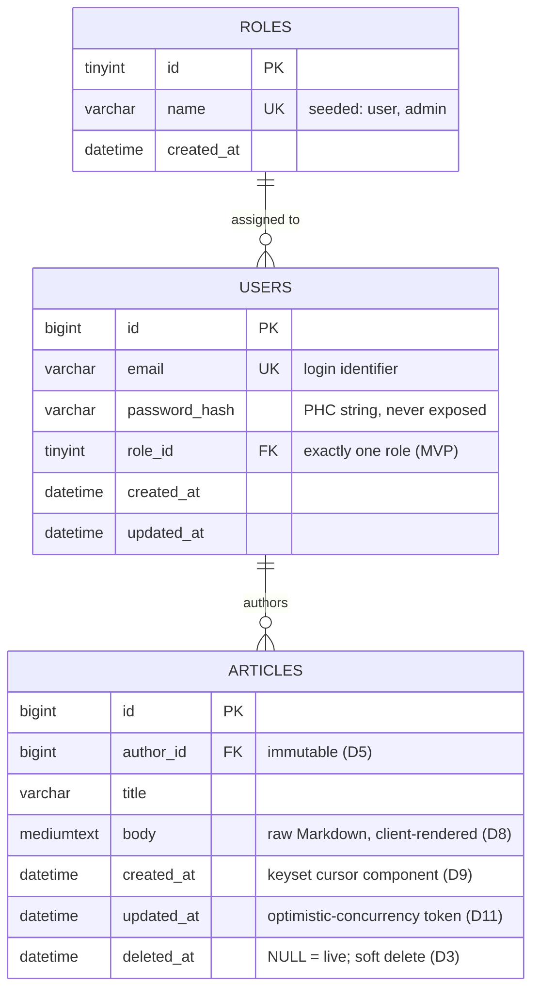
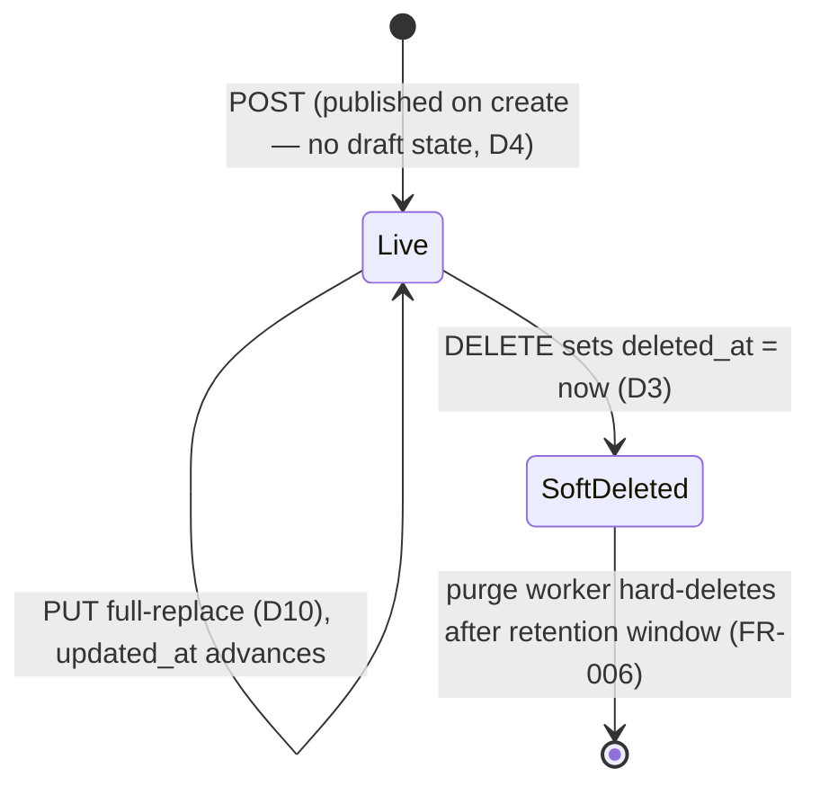

# Data Model / ERD

> **Status:** ✅ Approved · **Owner:** Simon Sibomana · **Last updated:** 2026-07-12

The relational model behind the platform: three core tables — `roles`, `users`, `articles` — held in
**MySQL 8 (InnoDB), the single source of truth** ([ADR-0003](../architecture/adr/0003-mysql-source-of-truth.md)).
This document is the canonical description of tables, columns, constraints, and lifecycle semantics.
Index *rationale* lives in [indexing-strategy.md](indexing-strategy.md); schema *change process* lives in
[migrations.md](migrations.md); cache key shapes in [caching-strategy.md](caching-strategy.md).

The schema encodes the MVP product decisions from
[PRD §13](../requirements/product-requirements.md): soft delete for articles only (D3), no draft
state (D4), immutable authorship (D5), author-only list filter (D7), raw Markdown bodies (D8),
keyset pagination (D9), and optimistic concurrency (D11).

## 1. Design principles

1. **Read-optimized, deliberately simple.** Three tables, no over-normalization
   (per the brief): the public read path must resolve with primary-key or single-index seeks —
   no hot-path joins.
2. **Soft delete for articles only.** `articles.deleted_at` (`NULL` = live) gives recoverability
   within the retention window; a scheduled worker hard-purges expired rows (FR-006). **Users are
   never soft-deleted** — PII is erased by anonymization (see §6.3), because a flag is not erasure
   under GDPR/CCPA (D3).
3. **Invariants live in the database.** Ownership, role assignment, uniqueness, and referential
   integrity are enforced by constraints, not only application code — Redis may be cold or absent
   at any time without affecting correctness ([ADR-0003](../architecture/adr/0003-mysql-source-of-truth.md)).
4. **Every column earns its place.** Anything not needed by an FR is deliberately absent and
   listed in §8 with its evolution path, so additions are conscious decisions rather than drift.

## 2. ERD



## 3. Table specifications

### 3.1 `roles`

Static lookup table for the two MVP authorization roles ([authn-authz](../security/authn-authz.md)).
Rows are **seed data**, inserted idempotently by a migration (see [migrations §8](migrations.md)) —
never created through the API in the MVP.

| Column | Type | Null | Default | Constraints | Notes |
|---|---|---|---|---|---|
| `id` | `TINYINT UNSIGNED` | no | auto-increment | PK | Tiny static lookup — 1 byte; a wider type buys nothing and bloats every `users` row and FK index |
| `name` | `VARCHAR(32)` | no | — | `uq_roles_name` | Seeded values: `user`, `admin`. JWT role claims carry the name; authorization checks compare against it |
| `created_at` | `DATETIME(6)` | no | `CURRENT_TIMESTAMP(6)` | | UTC (see §5) |

### 3.2 `users`

One row per registered account (FR-001). The email is the unique login identifier; the password
exists only as a salted adaptive hash ([NFR Security](../requirements/non-functional-requirements.md)).

| Column | Type | Null | Default | Constraints | Notes |
|---|---|---|---|---|---|
| `id` | `BIGINT UNSIGNED` | no | auto-increment | PK | Stable principal id; JWT `sub` claim; never reused |
| `email` | `VARCHAR(254)` | no | — | `uq_users_email` | Login identifier; 254 is the practical RFC 5321 maximum address length. Normalized (trimmed, lowercased) by the application before storage so uniqueness is case-insensitive by construction |
| `password_hash` | `VARCHAR(255)` | no | — | | Full PHC-format string (argon2id preferred, bcrypt acceptable) — algorithm, parameters, salt, and hash in one self-describing value, so the algorithm can be upgraded per-user on next login. Never selected into API responses, never logged |
| `role_id` | `TINYINT UNSIGNED` | no | — | `fk_users_role_id` → `roles.id`, RESTRICT | Exactly one role per user (MVP) — see §4.2. Default role `user` is assigned by the application at registration (FR-001), not by a column default, so role assignment is always explicit |
| `created_at` | `DATETIME(6)` | no | `CURRENT_TIMESTAMP(6)` | | |
| `updated_at` | `DATETIME(6)` | no | `CURRENT_TIMESTAMP(6)` on update | | Touched by role changes and the anonymization procedure (§6.3) |

### 3.3 `articles`

The content table — the read-heavy hot path (FR-004, FR-005). Bodies are stored **raw** and
returned as-is; Markdown is the documented convention and rendering is the client's concern (D8).

| Column | Type | Null | Default | Constraints | Notes |
|---|---|---|---|---|---|
| `id` | `BIGINT UNSIGNED` | no | auto-increment | PK | Public identifier in read URLs; keyset-cursor tiebreaker (D9) |
| `author_id` | `BIGINT UNSIGNED` | no | — | `fk_articles_author_id` → `users.id`, RESTRICT | **Immutable after insert** (D5) — enforced in the service layer (no `UPDATE` ever sets it); admins edit content, never ownership |
| `title` | `VARCHAR(255)` | no | — | | Hard schema ceiling; the API enforces its own (≤ 255) maximum per FR-004 input bounds, configured in [configuration-reference](../operations/configuration-reference.md) |
| `body` | `MEDIUMTEXT` | no | — | | Up to 16 MiB at the schema level; the **effective** bound is the application's request-size limit ([NFR Security](../requirements/non-functional-requirements.md)) — the column type just guarantees no silent truncation below it. Bounded text only; media is out of scope ([PRD §4](../requirements/product-requirements.md)) |
| `created_at` | `DATETIME(6)` | no | `CURRENT_TIMESTAMP(6)` | indexed (see [indexing-strategy](indexing-strategy.md)) | Second component of the `(created_at, id)` keyset cursor (D9); microsecond precision keeps list ordering deterministic even for same-second inserts |
| `updated_at` | `DATETIME(6)` | no | `CURRENT_TIMESTAMP(6)` on update | | **The optimistic-concurrency token (D11)** — see §6.2 |
| `deleted_at` | `DATETIME(6)` | yes | `NULL` | leading column of both list indexes | `NULL` = live. Set by soft delete (FR-004); rows past the retention window are hard-purged by the background worker (FR-006). Why a timestamp and not a boolean: the purge job needs *when*, and `NULL` doubles as the live flag |

## 4. Relationships & integrity rules

### 4.1 Foreign keys

| Constraint | From → To | `ON DELETE` | Rationale |
|---|---|---|---|
| `fk_users_role_id` | `users.role_id` → `roles.id` | `RESTRICT` | A role with members can never vanish; roles are seed data and effectively permanent |
| `fk_articles_author_id` | `articles.author_id` → `users.id` | `RESTRICT` | Articles must never be orphaned **or silently mass-deleted by a cascade**. User erasure is the explicit anonymization procedure in §6.3, not a `DELETE` that fans out |

`ON UPDATE` is `RESTRICT` for both — primary keys are never rewritten.

Both FK columns are covered by an existing index (`articles.author_id` leads
`idx_articles_author_deleted_created`; `users.role_id` gets the index InnoDB requires for the
constraint), so constraint checks never scan.

### 4.2 User ↔ role: single FK, not a join table

The MVP uses a **single `role_id` FK** on `users` rather than a `user_roles` join table:

- The product defines exactly two roles with strictly increasing privilege (`admin` ⊃ `user`) and
  **one role per principal** — there is no requirement, current or planned, for role composition
  ([PRD §5](../requirements/product-requirements.md), FR-003).
- A join table would force the auth path (every authenticated request, after JWT validation at
  login time) through an extra join or a second query, and would create the multi-role ambiguity
  ("which role claim goes in the JWT?") that the product explicitly avoids.
- **Evolution path** if multi-role ever arrives: introduce `user_roles(user_id, role_id)` via
  expand/contract ([migrations §6](migrations.md)) — backfill one row per user from `role_id`,
  switch reads, then drop the column. Nothing in the current design blocks this.

Decision recorded in [ADR-0007](../architecture/adr/0007-single-role-fk.md), including the
alternatives considered (join table, enum/string column, full role→permission schema).

### 4.3 What the database does *not* enforce

Documented so nobody assumes otherwise — these invariants are owned by the service layer and
covered by its TDD suites ([testing strategy](../development/testing-strategy.md)):

| Invariant | Owner | Why not the DB |
|---|---|---|
| Authorship immutability (D5) | Service layer + acceptance tests | MySQL has no per-column "immutable after insert"; a trigger would hide the rule from the code path |
| Title/body maximum lengths (FR-004) | Pydantic validation (`422`) | Schema types are ceilings; product limits are configuration, changeable without DDL |
| Password policy (FR-001) | Application (NIST 800-63B screening) | Not expressible in DDL |
| `deleted_at IS NULL` on every read | Repository layer (single chokepoint) | It is a query predicate, not a constraint; centralized in the repository so it cannot be forgotten per-endpoint |

## 5. Storage conventions

| Convention | Value | Rationale |
|---|---|---|
| Engine | InnoDB | Transactions, row-level locking, FK support ([ADR-0003](../architecture/adr/0003-mysql-source-of-truth.md)) |
| Charset / collation | `utf8mb4` / `utf8mb4_0900_ai_ci` | Full Unicode (including supplementary planes — article bodies are user text); the MySQL 8 default collation, accent/case-insensitive |
| Timestamps | `DATETIME(6)`, **always UTC**, written by the application | Avoids `TIMESTAMP`'s 2038 range ceiling and session-time-zone coupling; microseconds serve the keyset cursor and the concurrency token. The API renders ISO-8601 UTC per the [PRD data-format conventions](../requirements/product-requirements.md) |
| Surrogate keys | `BIGINT UNSIGNED AUTO_INCREMENT` | Monotonic inserts keep the clustered index append-only (no page splits on the write path) and make the `(created_at, id)` cursor total-ordered. UUIDv4 keys were rejected: random clustered-key inserts fragment InnoDB pages and double index size; id enumeration is harmless here because article reads are public by design |
| Identifier naming | `snake_case`; constraints prefixed `pk_` / `fk_` / `uq_` / `idx_` / `ck_` + table + column(s) | Deterministic names are what make migrations reversible — see the shared naming convention in [migrations §3](migrations.md), which generates exactly these names |
| Secondary indexes | Defined and justified in [indexing-strategy.md](indexing-strategy.md) | Single home for index rationale; the DDL in §7 mirrors that inventory. Note InnoDB secondary indexes implicitly append the PK, so `idx_articles_deleted_created` is effectively `(deleted_at, created_at, id)` — exactly the keyset-cursor shape |

## 6. Lifecycle semantics

### 6.1 Article lifecycle (D3, D4)



- Every transition is a MySQL transaction that **also invalidates the affected cache keys**
  within the same request path ([caching-strategy](caching-strategy.md)).
- Soft-deleted rows are invisible to every API read (`404` on direct fetch, excluded from lists)
  but remain recoverable by an operator until purge.
- The purge worker deletes in **bounded batches** keyed on `deleted_at <` (now − retention
  window) and is idempotent — re-running over already-purged ids affects zero rows (FR-006).
  Restoration within the window is an operator action (direct `UPDATE ... SET deleted_at = NULL`),
  not an API feature.

### 6.2 Optimistic concurrency (D11)

`articles.updated_at` is the concurrency token:

- Read responses expose the article's `updated_at` at **full microsecond precision**; clients echo
  it back as the precondition value, treated as opaque.
- `PUT`/`DELETE` require the precondition via **`If-Match`** (a missing precondition ⇒ `422`).
  `If-Unmodified-Since` is **not** accepted — its one-second HTTP-date granularity is too coarse for
  `DATETIME(6)`, which is why `If-Match` is canonical. The update runs as
  `UPDATE ... WHERE id = ? AND updated_at = ?`; **zero rows affected ⇒ `409`** — the
  compare-and-set happens in one statement, no read-modify-write race.
- A separate integer `version` column was considered and rejected for the MVP: `updated_at` must
  exist anyway, `DATETIME(6)` collisions require two commits to the same row in the same
  microsecond (not a realistic risk at ~5 writes/s — [capacity model](../architecture/capacity-scaling-model.md)),
  and one fewer column keeps `PUT` full-replace semantics trivial. Revisit only if a future bulk
  or high-frequency write path appears.

### 6.3 User erasure (GDPR/CCPA — D3)

Right-to-erasure requests are honored by **anonymize-in-place**, preserving referential integrity
for authored articles (authorship is immutable, D5; `ON DELETE RESTRICT` makes accidental cascades
impossible):

1. In one transaction: set `email` to an unrouteable tombstone unique per row
   (`erased-{id}@invalid.invalid`), set `password_hash` to a random value that can never verify,
   leaving `role_id` as-is (role is not PII).
2. The account can no longer authenticate (unknown email, unverifiable hash); existing JWTs
   expire within 15 minutes ([PRD §13 D1](../requirements/product-requirements.md)).
3. The user's **articles are untouched** — they are content, not PII. If the requester also wants
   their content gone, that is the normal article soft-delete → purge path (FR-006).
4. Backups age out per the retention policy in the
   [NFR data-management section](../requirements/non-functional-requirements.md); erasure is not
   retroactively applied inside backups (industry-standard posture — documented, time-bounded).

The tombstone keeps `uq_users_email` satisfied and the row count stable; no column is nulled, so
`NOT NULL` constraints stay intact.

## 7. Reference DDL

Canonical shape of the schema. The **operative** source of truth is the SQLAlchemy models plus the
Alembic migration chain ([migrations.md](migrations.md)) — this block is kept in sync for review
and for spinning up scratch databases, and any drift is a bug.

```sql
CREATE TABLE roles (
    id          TINYINT UNSIGNED NOT NULL AUTO_INCREMENT,
    name        VARCHAR(32)      NOT NULL,
    created_at  DATETIME(6)      NOT NULL DEFAULT CURRENT_TIMESTAMP(6),
    PRIMARY KEY (id),
    CONSTRAINT uq_roles_name UNIQUE (name)
) ENGINE=InnoDB DEFAULT CHARSET=utf8mb4 COLLATE=utf8mb4_0900_ai_ci;

CREATE TABLE users (
    id            BIGINT UNSIGNED  NOT NULL AUTO_INCREMENT,
    email         VARCHAR(254)     NOT NULL,
    password_hash VARCHAR(255)     NOT NULL,
    role_id       TINYINT UNSIGNED NOT NULL,
    created_at    DATETIME(6)      NOT NULL DEFAULT CURRENT_TIMESTAMP(6),
    updated_at    DATETIME(6)      NOT NULL DEFAULT CURRENT_TIMESTAMP(6)
                                   ON UPDATE CURRENT_TIMESTAMP(6),
    PRIMARY KEY (id),
    CONSTRAINT uq_users_email UNIQUE (email),
    CONSTRAINT fk_users_role_id FOREIGN KEY (role_id) REFERENCES roles (id)
        ON DELETE RESTRICT ON UPDATE RESTRICT
) ENGINE=InnoDB DEFAULT CHARSET=utf8mb4 COLLATE=utf8mb4_0900_ai_ci;

CREATE TABLE articles (
    id          BIGINT UNSIGNED NOT NULL AUTO_INCREMENT,
    author_id   BIGINT UNSIGNED NOT NULL,
    title       VARCHAR(255)    NOT NULL,
    body        MEDIUMTEXT      NOT NULL,
    created_at  DATETIME(6)     NOT NULL DEFAULT CURRENT_TIMESTAMP(6),
    updated_at  DATETIME(6)     NOT NULL DEFAULT CURRENT_TIMESTAMP(6)
                                ON UPDATE CURRENT_TIMESTAMP(6),
    deleted_at  DATETIME(6)     NULL DEFAULT NULL,
    PRIMARY KEY (id),
    KEY idx_articles_deleted_created (deleted_at, created_at),
    KEY idx_articles_author_deleted_created (author_id, deleted_at, created_at),
    CONSTRAINT fk_articles_author_id FOREIGN KEY (author_id) REFERENCES users (id)
        ON DELETE RESTRICT ON UPDATE RESTRICT
) ENGINE=InnoDB DEFAULT CHARSET=utf8mb4 COLLATE=utf8mb4_0900_ai_ci;

-- Seed data (applied as an idempotent data migration — see migrations.md §8):
-- INSERT INTO roles (name) VALUES ('user'), ('admin');
```

## 8. Deliberately absent (with evolution paths)

| Absent | Why (decision) | Evolution path if needed |
|---|---|---|
| `articles.status` (draft/published) | Published-on-create, no draft state — **D4**. The previous draft of this ERD carried a `status` column; it is removed deliberately | Add `status` via expand/contract; re-lead list indexes as `(deleted_at, status, created_at)` per the note in [indexing-strategy](indexing-strategy.md) |
| Article slug / natural key | No URL-slug requirement; id-based reads | Add `slug` with a uniqueness constraint that accounts for soft-deleted rows — see the unique-constraint trap in [indexing-strategy](indexing-strategy.md) |
| `user_roles` join table | Single role per user — §4.2 | Expand/contract to a join table; backfill from `role_id` |
| Refresh-token / session table | No refresh tokens in MVP — **D1**; JWTs are stateless | Post-MVP refresh-token rotation requires a server-side token table (rotation + reuse detection) |
| Idempotency-key table | Create idempotency deferred — **D12** | `idempotency_keys(key, user_id, response_hash, expires_at)` when `Idempotency-Key` lands |
| Audit/event table | MVP audit trail is structured logs with `request_id` ([NFR Observability](../requirements/non-functional-requirements.md)) | Dedicated append-only audit table if compliance requires queryable history |
| `users.deleted_at` | Users are anonymized, never soft-deleted — §6.3 (D3) | None — soft-deleting PII is the anti-pattern this design avoids |
| Full-text index on `body` | Search is an explicit non-goal ([PRD §4](../requirements/product-requirements.md)) | External search engine before `FULLTEXT`, if search ever enters scope |

## 9. Volumetrics

Planning numbers from the [capacity & scaling model](../architecture/capacity-scaling-model.md)
(validated at M6):

| Table | Rows (MVP planning) | Growth driver | Size control |
|---|---|---|---|
| `roles` | 2 | None (seed data) | — |
| `users` | ~1,000 | Registrations | Anonymize-in-place keeps rows bounded by real signups |
| `articles` | ~10,000 live | ~5 writes/s peak, mostly updates | Retention purge (FR-006) caps soft-deleted carry; at ~2–8 KB per body the table is tens of MB — index and buffer-pool pressure, not storage, is the constraint that matters |

At this scale every table fits comfortably in the InnoDB buffer pool; the design's performance
risk is index shape (covered in [indexing-strategy](indexing-strategy.md)) and cache hit ratio
(covered in [caching-strategy](caching-strategy.md)), not data volume.

## 10. References

- [PRD §13 decisions D1–D12](../requirements/product-requirements.md) · [Functional requirements](../requirements/functional-requirements.md) (FR-001–FR-006) · [NFR — Data Management & Durability](../requirements/non-functional-requirements.md)
- [ADR-0003 MySQL as source of truth](../architecture/adr/0003-mysql-source-of-truth.md) · [ADR-0004 Redis cache-aside](../architecture/adr/0004-redis-cache-aside.md)
- [Indexing strategy](indexing-strategy.md) · [Migrations guide](migrations.md) · [Caching strategy](caching-strategy.md)
- [Capacity & scaling model](../architecture/capacity-scaling-model.md) · [Threat model](../security/threat-model.md)
